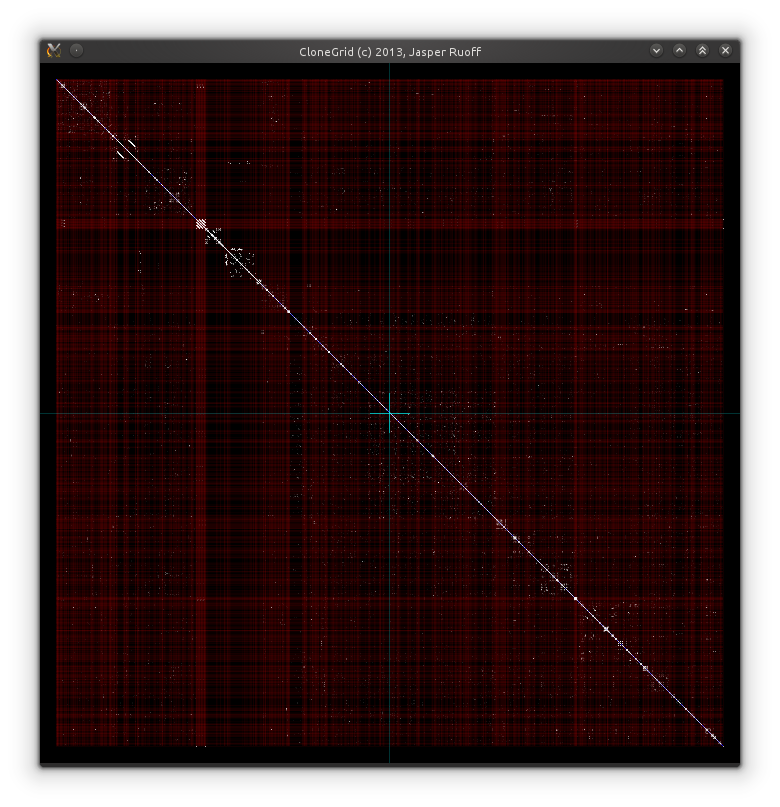

CloneGrid
=========

CloneGrid is an intuitive tool for finding and analyzing code clones. Code clones are snippets of source code that are very similar to each other and in most cases are the result of a *copy-past-edit* style of programming. CloneGrid makes a visual representation of the code base under review, in this grid like representation code clones can be spotted easily.



*CloneGrid featuring Jenkins.*

CloneGrid is designed and programed with performance in mind. This makes it possible to load thousands of files, which in total contain over a million lines of code, in a matter of seconds, and without any noticeable slowdown in rendering.

The project is in a very early stage still, and many usability improvements can be made. I hope to add some improvements soon. If you can't wait to test CloneGrid yourself, follow the steps below to build and run the project:

```
git clone git@github.com:jruoff/CloneGrid.git
cd CloneGrid
mkdir build
cd build
cmake ..
make
./clonegrid .. # or ./clonegrid <path to your project>
```

Hint: Make sure you have CMake, make and a C++11 compiler installed (I currently use GCC 4.7.3). Make sure you have the boost libraries installed, and make sure you have OpenGL GLUT installed.


*CloneGrid featuring Jenkins, zoomed in.*
